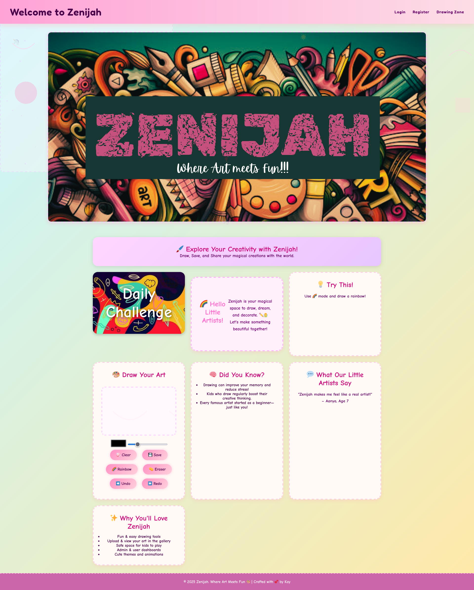
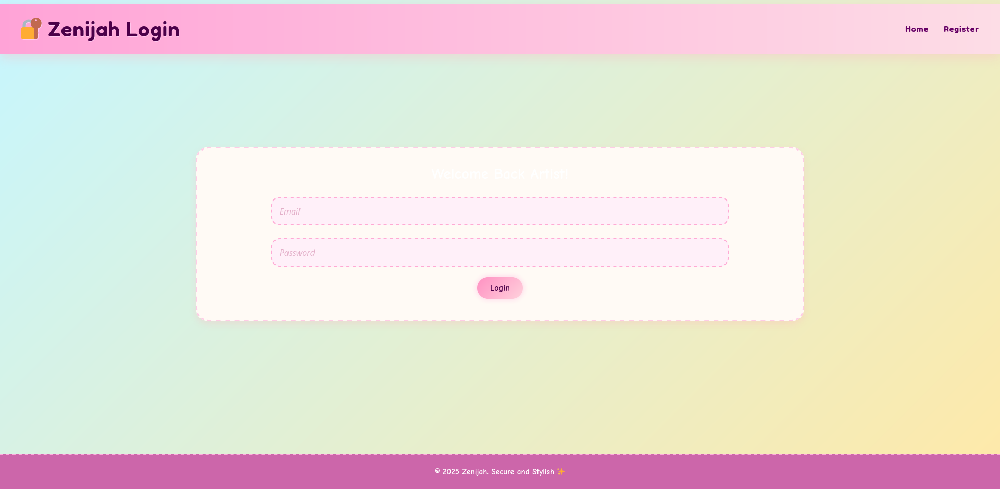
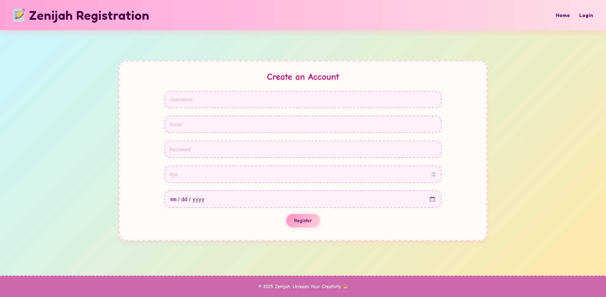
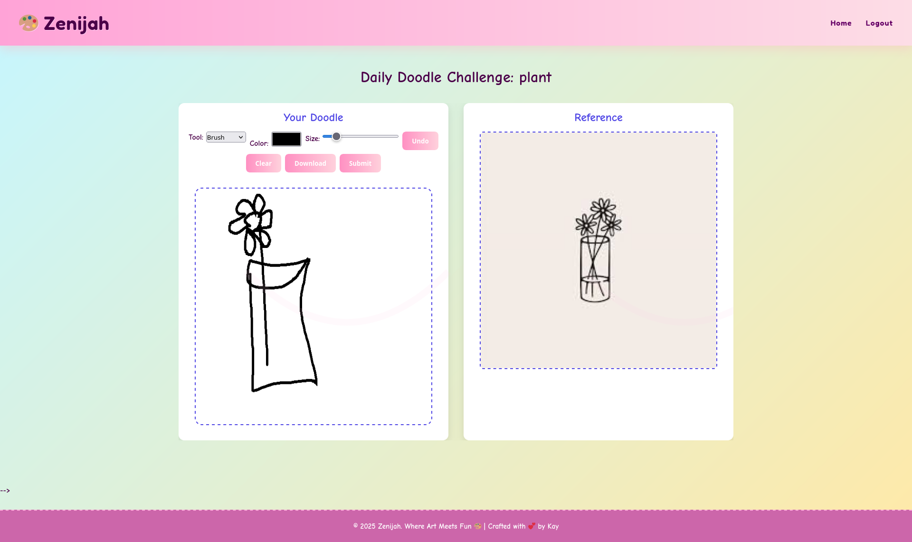
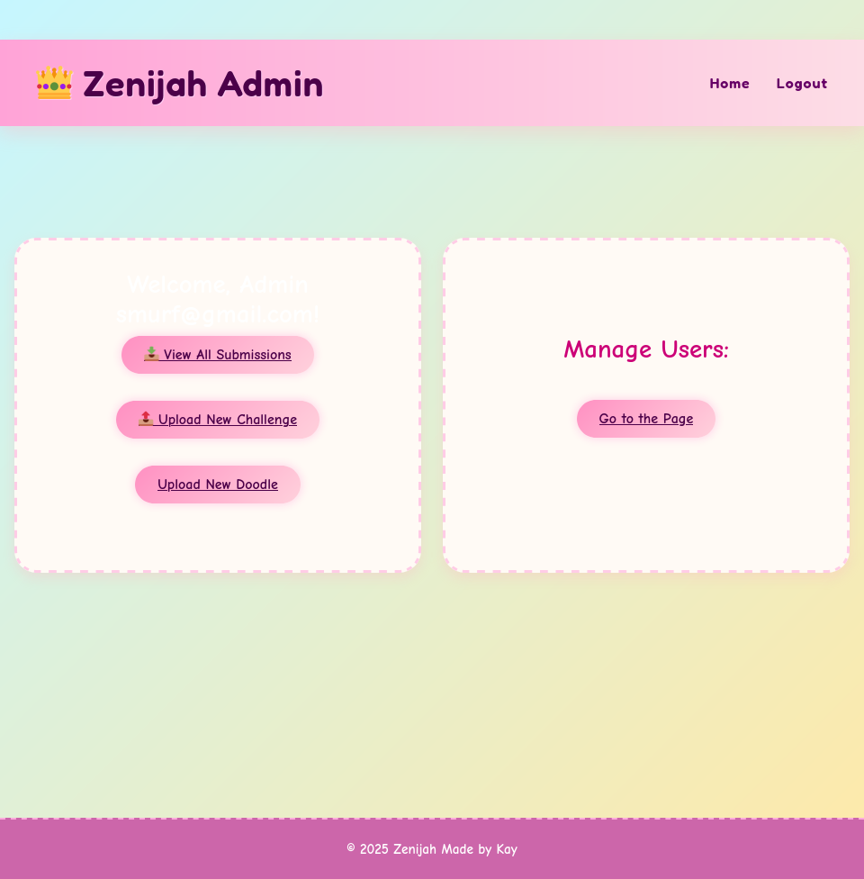
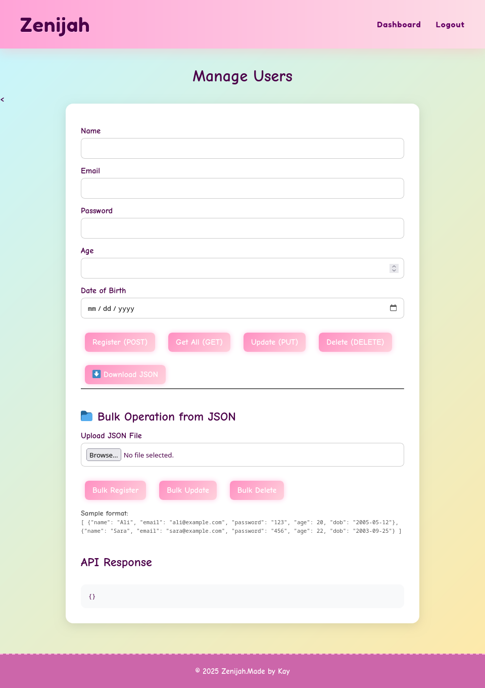

# Zenijah – Kids' Doodle & Art Platform

Zenijah is a fun, web-based platform built for children to explore creativity through digital doodling and daily art challenges. It features a full user authentication system and Role-Based Access (RBA), allowing kids to draw, save their art, and engage in challenges, while admins can manage the platform and its users.

---

## Key Features

### For Users (Kids)
- Draw and doodle using the in-browser sketch tool
- Save or download artwork to local storage
- View and complete daily drawing challenges
- Manage your own profile (update/delete)
- Personal user dashboard
- Manage User - single or multiple thorough jsons 

### For Admins
- Login to admin dashboard
- View, add, update, or delete users
- Add and manage doodles/art assets
- Create and assign daily challenges
- Rate user submissions

---

## Technologies Used

- **Java (Servlets, JSP, HTTP Sessions)**
- **JSP + HTML5 + CSS3**
- **NetBeans IDE**
- **Apache Tomcat**
- **Manual CRUD logic** (for both user and admin management)
- **RESTful APIs**

---

## Architecture

Zenijah follows a Model-View-Controller (MVC)-like structure:

- **Servlets (Controller):** Handle HTTP requests, sessions, and logic.
- **JSP Pages (View):** Render dynamic content using HTML + JSP tags.
- **MySQL (Model):** Stores users, doodles, challenges.
- **HTTP Sessions:** Track user state (login, role).

Admins and users have separate dashboards. Role-based access is managed via session variables and database flags.


## Project Structure

```
Zenijah/
├── build/                  # Compiled bytecode and output files
├── dist/                   # Generated WAR file
├── nbproject/              # NetBeans configuration
├── src/                    # Java source files (Servlets, Logic)
│   └── com/
│       └── zenijah/
│           ├── controllers/
│           ├── models/
│           └── utils/
├── web/                    # Web application root (Tomcat's web content)
│   ├── WEB-INF/            # Web config directory
│   │   ├── web.xml         # Deployment descriptor
│   └── pages/              # JSP files
│       ├── login.jsp
│       ├── register.jsp    # and more
│   └── css/                # Stylesheets
│   └── js/                 # (if any JavaScript)
├── screenshots/            # Screenshots for README.md
├── README.md
└── build.xml               # Ant build configuration
```

## Getting Started

### Prerequisites

Make sure you have:

- Java JDK 8 or above
- Apache Tomcat (10.1+ recommended)
- NetBeans (or another Java IDE)
- Git (for cloning)
- A browser (Chrome/Firefox)

## Screenshots

### Home Page  


### Login Page  


### Register Page  


### Drawing Tool  


### Admin Panel  


### Manage User Page  



### Installation

```bash
git clone https://github.com/ogguyhere/Zenijah.git
cd Zenijah
```
